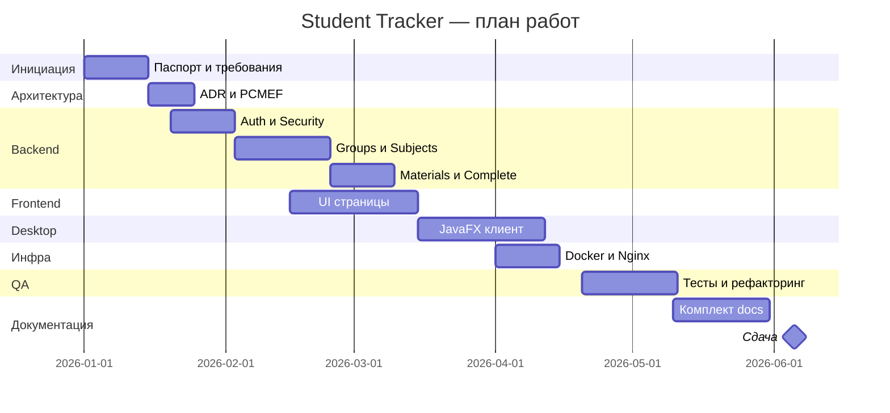

# Диаграмма Ганта (план-факт)

**Проект:** Student Tracker · **Срок:** 01.01.2026 — 05.06.2026

## Вехи

| Дата | Веха |
|------|------|
| 20.01.2026 | Рабочий login + JWT |
| 15.03.2026 | CRUD предметов и материалов |
| 01.04.2026 | Docker Compose |
| 15.05.2026 | Desktop feature-complete |
| 05.06.2026 | Сдача проекта |
